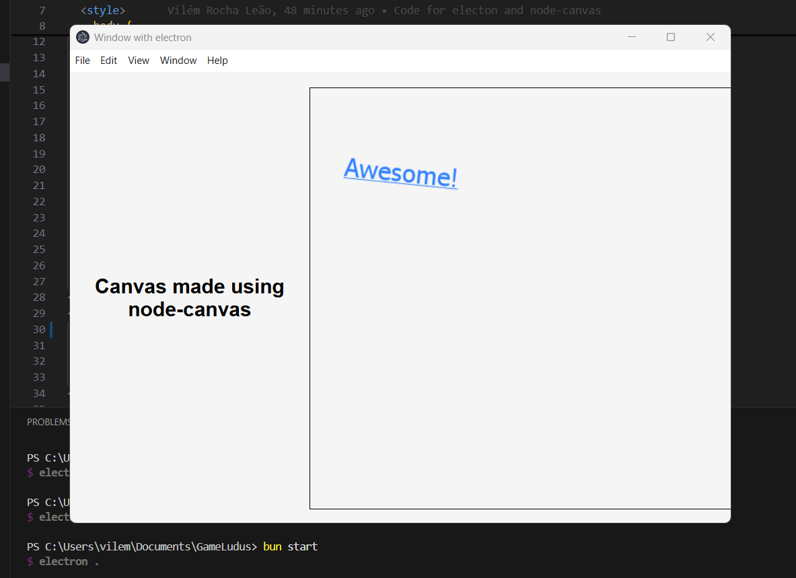

# GameLudus 👾
### v0.0.1

GameLudus is a powerful library designed for developers looking to create engaging 2D games using Çb, a custom programming language. With its seamless integration of node-canvas and Electron, GameLudus aims at simplifying game development while making it an enjoyable experience.

### Ludus stands for pleasure and is also related to training and learning, which are the main goals of this library!

## Features 🛠️
- **Seamless Integration**: A robust connection between node-canvas and Electron for smooth game performance.

## Upcoming Features ⏰
- **User-Friendly API**: Easy-to-use functions for beginners and advanced developers alike.
- **Extensible**: Designed with future expansion in mind, allowing for the addition of new functionalities.
- **Window and Sprite Management**: Create customizable game windows and dynamic sprites.
- **Advanced Rendering**: Efficiently render textures and animations for a polished look.
- **Collision Detection**: Implement accurate collision detection for interactive gameplay.
- **Keyboard Input Handling**: Read and respond to keyboard inputs for player controls and actions.
- **Sound output**: Possibility of playing sound effects from .mp3 and .ogg files.

## Screenshots 🖼️


## Getting Started 🚀
To get started with GameLudus, follow these steps:

### 1. Download the Library
Download the GameLudus files and place them in your project directory.

### 2. Import the Library
In your main game file, import the `gameLudus.çb` file to access the library’s functionalities.

Here’s a basic example to create a game window and start your first game:
```GDscript
    # Import the GameLudus library
    import('./path/to/gameLudus.çb')

    # Initialize the game
    const game = GameLudus.InitGame()

    # Create a game window
    game.createWindow(800, 600, 'My First Game')

    # Start the game loop
    game.start()
```

## License 📄
This project is licensed under the MIT License - see the `LICENSE` file for details.

### Conclusion
We welcome contributions from the community! Feel free to open issues or submit pull requests on GitHub. Let's create amazing games together with GameLudus!